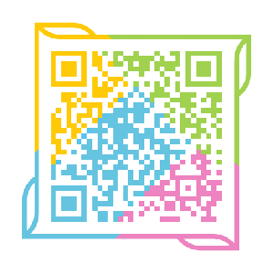

# GankKotlin

GankKotlin是[干货集中营](https://gank.io)移动端全家桶系列第四篇（之前已经实现了Flutter，React Native，微信小程序开发），根据 Gank.io 官方提供的api实现的Gank客户端

本项目基于MVVM架构开发，目前收藏功能仅支持本地存储，不支持离线存储

[同款React Native干货集中营](https://github.com/fujianlian/GankRN)

[同款flutter干货集中营](https://github.com/fujianlian/GankFlutter)

[同款小程序干货集中营](https://github.com/fujianlian/GankMini)

## 应用截图

 |  |  |
| :--: | :--: | :--: |
| 最新 | 分类 | 收藏 |

## Android app下载

 |  |
| :--: | :--: |
| 蒲公英渠道 | github渠道 |

## 贡献

* 如果你在使用过程中遇到问题，欢迎给我提Issue

* 如果你有好的想法，欢迎pull request

* 觉得不错的话，顺手[点个Star](https://github.com/fujianlian/GankKotlin)，笔者需要您的支持

## 特别感谢

* api提供：[@代码家](https://github.com/daimajia)

* [干货集中营](https://gank.io)

